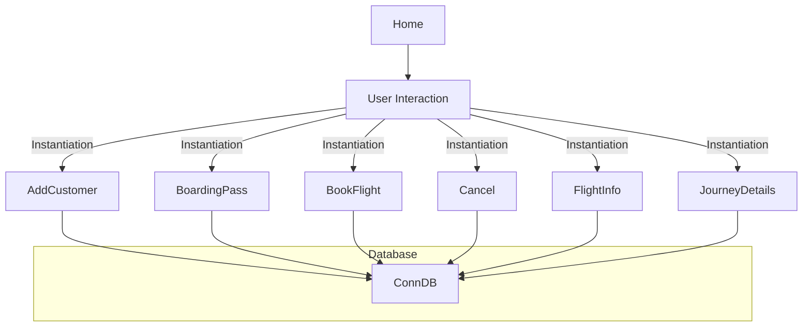
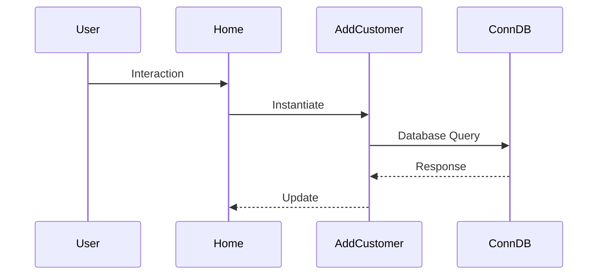

# System Architecture

## Architecture Overview
The Airline Management System is built using a combination of Java Swing for the graphical user interface (GUI) and Java for the backend logic. The system follows a **Model-View-Controller (MVC) pattern**, although it's not strictly implemented, as the GUI components handle both the view and controller aspects. The system can be considered as a **Component-based architecture**, where each component (e.g., `AddCustomer`, `BookFlight`) represents a specific functionality.

## Component Architecture
The system consists of several components, each representing a specific functionality:

* `Home`: The main entry point of the application, responsible for displaying the GUI and handling user interactions.
* `AddCustomer`, `BoardingPass`, `BookFlight`, `Cancel`, `FlightInfo`, `JourneyDetails`: These components represent individual functionalities and are instantiated based on user interactions.

## System Flow


## Technology Integration
The system integrates the following technologies:

* **Java Swing**: For building the GUI components.
* **Java**: For implementing the backend logic.
* **SQL**: For interacting with the database through the `ConnDB` class.

## Data Flow


## Security Architecture
The system does not have a robust security architecture in place. However, it uses a basic **authentication mechanism** through the `Login` class.

## Directory Structure
```
AirlineManagementSystem/
bproject/
project.xml
private/
private.xml
config.properties
src/
airlinemanagementsystem/
AddCustomer.java
BoardingPass.java
BookFlight.java
Cancel.java
ConnDB.java
FlightInfo.java
Home.java
JourneyDetails.java
Login.java
```

## Key Design Patterns
The system employs the following design patterns:

* **MVC pattern**: Although not strictly implemented, the system follows the MVC pattern.
* **Component-based architecture**: Each component represents a specific functionality.

Note that the system can be improved by implementing a more robust security architecture, separating the concerns of the GUI components, and using a more structured approach to database interactions.