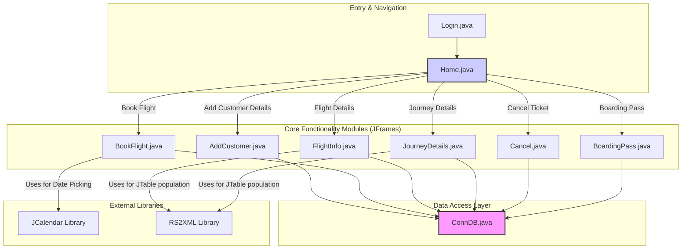
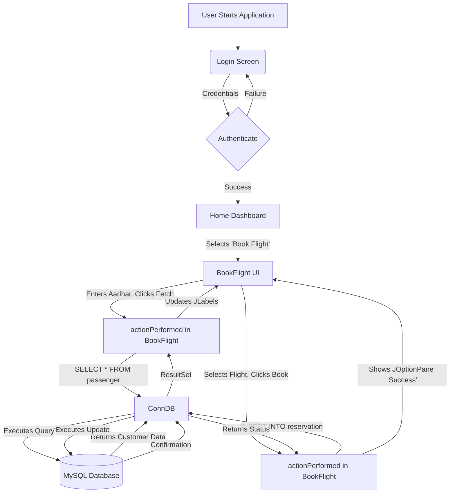
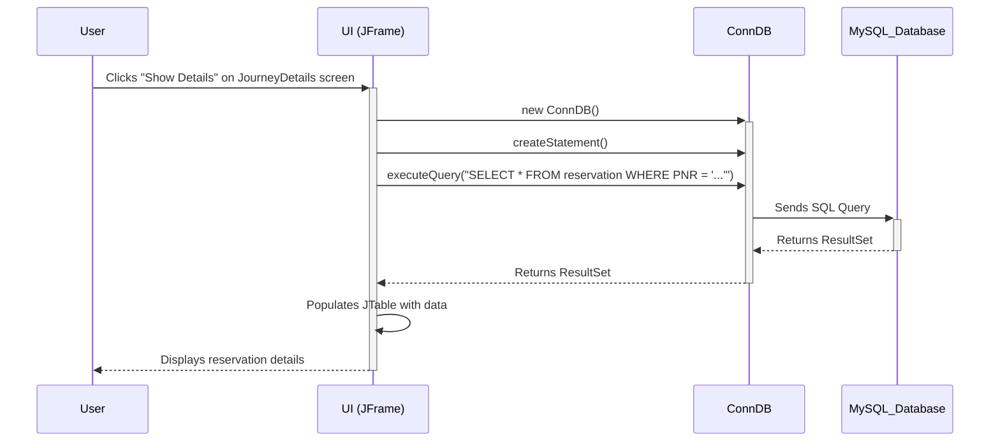

# System Architecture

## Architecture Overview
The Airline Management System is a monolithic desktop application built using Java Swing. The architecture follows a basic **Model-View-Controller (MVC)** pattern, although with tight coupling between the View and Controller layers.

-   **Model:** The data layer is represented by the MySQL database and the `ConnDB.java` class, which acts as a simple Data Access Object (DAO). It handles all JDBC connections and statement execution.
-   **View:** The user interface is composed of multiple `JFrame` classes (e.g., `Home`, `AddCustomer`, `BookFlight`). Each frame is responsible for rendering a specific screen with Swing components like `JLabel`, `JTextField`, and `JButton`.
-   **Controller:** The controller logic is implemented directly within the View classes. Each `JFrame` implements the `ActionListener` interface, and the `actionPerformed` method contains the business logic and event handling for that specific view. This includes reading user input, constructing SQL queries, and updating the UI based on database responses.

This design is straightforward for a small-scale desktop application but results in low cohesion and high coupling, as UI, business logic, and data access calls are mixed within the same classes.

## Component Architecture
The system is composed of several interconnected UI frames that are orchestrated by a central `Home` frame. The `ConnDB` component is a critical shared dependency, providing database connectivity to all other components that require data persistence or retrieval.



**Component Descriptions:**
*   **Login.java**: (Inferred from project files) The application's entry point, responsible for user authentication.
*   **Home.java**: The main dashboard that appears after a successful login. It uses a `JMenuBar` to provide navigation to all other features of the application. It acts as the central controller/navigator.
*   **AddCustomer.java**: A UI form for registering new passengers. It collects user details and inserts them into the `passenger` table via `ConnDB`.
*   **BookFlight.java**: A comprehensive module to book tickets. It fetches customer data, allows selection of flights, and creates a new entry in the `reservation` table.
*   **FlightInfo.java / JourneyDetails.java**: These are data-display modules. They fetch flight and reservation information from the database and display it in a `JTable`, using the `RS2XML` library to simplify the process.
*   **Cancel.java**: Handles ticket cancellation. It fetches a reservation by PNR, adds a record to the `cancel` table, and deletes the original reservation.
*   **BoardingPass.java**: Fetches and displays booking details in a boarding pass format for a given PNR.
*   **ConnDB.java**: A singleton-like utility class that encapsulates all JDBC connection logic to the MySQL database. It is instantiated by every component that needs to interact with the database.

## System Flow
The typical user flow begins with authentication, followed by navigation through the main menu to access various functionalities. Each action that requires data interaction follows a similar pattern of communicating with the database through the `ConnDB` class.



## Technology Integration
The system integrates several core Java technologies and third-party libraries to deliver its functionality.

*   **Core Language**: **Java SE** is the foundation of the application.
*   **User Interface**: **Java Swing** is used for building the graphical user interface (GUI). All visual components (`JFrame`, `JButton`, `JLabel`, etc.) are from this framework.
*   **Database Connectivity**: **JDBC (Java Database Connectivity)** is used to connect the Java application to the backend database. The specific driver used is `com.mysql.cj.jdbc.Driver`, indicating integration with a MySQL database.
*   **Database**: **MySQL** serves as the relational database management system (RDBMS) for storing all application data, including passenger details, flight information, and reservations.
*   **Third-Party Libraries**:
    *   **JCalendar (`com.toedter.calendar.JDateChooser`)**: This library is integrated into the `BookFlight.java` screen to provide a user-friendly date picker component, enhancing the user experience over a simple text field.
    *   **RS2XML (`net.proteanit.sql.DbUtils`)**: This utility library is used in `FlightInfo.java` and `JourneyDetails.java`. Its `resultSetToTableModel` method significantly simplifies the process of populating a `JTable` with data from a JDBC `ResultSet`, reducing boilerplate code.
*   **IDE**: The project structure and configuration files (`nbproject` directory) indicate that the application was developed using the **NetBeans IDE**.

## Data Flow
The data flow is a classic two-tier client-server model where the Java Swing application acts as the client and the MySQL database is the server. All interactions are initiated by the user.



## Security Architecture
The security posture of the application is minimal and contains significant vulnerabilities.

*   **Authentication**: A `Login.java` form is the entry point, suggesting a basic username/password authentication mechanism. The logic likely involves querying a `users` table in the database.
*   **Authorization**: There is no evidence of any role-based access control (RBAC). Once a user is authenticated, they appear to have access to all functionalities provided in the `Home` menu.
*   **Database Credentials**: The database connection in `ConnDB.java` uses hardcoded credentials (`"root"`, `"root"`). This is a critical security risk, as these credentials can be easily extracted from the compiled code.
*   **SQL Injection Vulnerability**: The application constructs SQL queries by directly concatenating user-provided strings. For example, in `BookFlight.java`:
    `String query="select * from passenger where aadhar = '"+aadhar+"'";`
    This practice makes the application highly vulnerable to SQL Injection attacks. A malicious user could manipulate the input to execute arbitrary SQL commands. The use of `PreparedStatement` is highly recommended to mitigate this risk.

## Directory Structure
The project follows a standard NetBeans Java project structure.

```
AirlineManagementSystem/
├── nbproject/         # NetBeans IDE project configuration files (metadata, build scripts)
│   ├── private/       # User-specific project settings
│   └── project.xml    # Main project definition file
├── src/               # Contains all the application source code
│   └── airlinemanagementsystem/
│       ├── icons/     # (Implied) Contains image assets (PNG, JPG) used in the UI
│       ├── AddCustomer.java
│       ├── BoardingPass.java
│       ├── BookFlight.java
│       ├── Cancel.java
│       ├── ConnDB.java
│       ├── FlightInfo.java
│       ├── Home.java
│       └── JourneyDetails.java
└── build.xml          # (Generated by NetBeans) Ant build script for compiling and running the project
```

## Key Design Patterns
Several fundamental design patterns are utilized, though sometimes in a simplified form.

*   **Model-View-Controller (MVC)**: As described in the overview, this is the main architectural pattern. However, the View and Controller are tightly coupled within the `JFrame` classes.
*   **Observer Pattern**: Java Swing's event handling model is a direct implementation of the Observer pattern.
    *   **Subject (Publisher)**: UI components like `JButton` (`save`, `fetchButton`, etc.).
    *   **Observer (Subscriber)**: The `JFrame` classes that implement `ActionListener`.
    *   **Mechanism**: The `addActionListener(this)` method call registers the frame as an observer. When the button is clicked (event occurs), the subject notifies the observer by invoking its `actionPerformed` method.
*   **Data Access Object (DAO)**: The `ConnDB.java` class acts as a simple DAO. It abstracts and encapsulates all database connection and statement execution logic from the rest of the application. This centralizes the data access code, making it easier to manage, although a more robust implementation would use connection pooling and `PreparedStatement`.