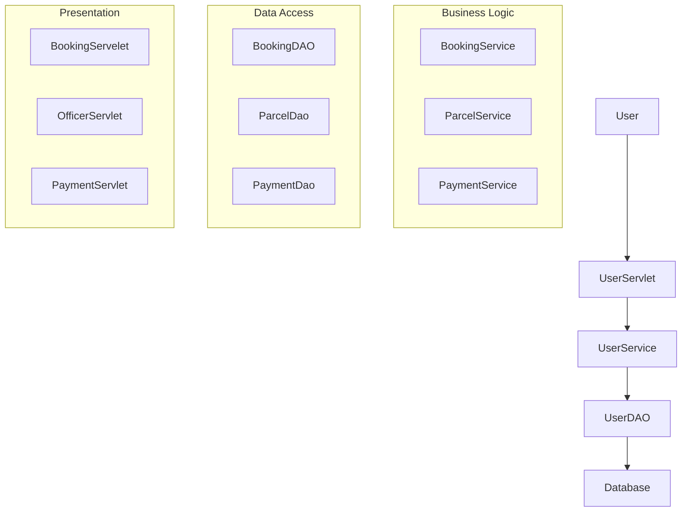
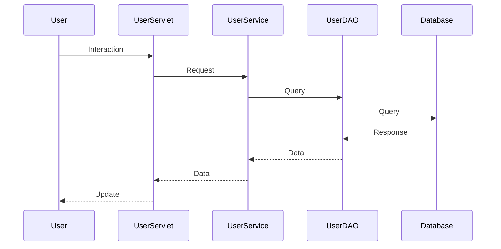

# System Architecture

## Architecture Overview
The system architecture of the Parcel Management System follows a Model-View-Controller (MVC) pattern. The system is divided into several layers, including the data access layer, business logic layer, and presentation layer.

## Component Architecture
The system consists of the following components:

* **Data Access Layer (DAO)**: This layer is responsible for interacting with the database. It includes classes such as `BookingDAO`, `ParcelDao`, `PaymentDao`, `UserDAO`, etc.
* **Business Logic Layer (Service)**: This layer is responsible for encapsulating the business logic of the system. It includes classes such as `BookingService`, `ParcelService`, `PaymentService`, `UserService`, etc.
* **Presentation Layer (Web)**: This layer is responsible for handling user interactions and displaying data. It includes classes such as `BookingServelet`, `DeliveryStatusServlet`, `OfficerServlet`, etc.

## System Flow


## Technology Integration
The system uses the following technologies:

* **Java**: The system is built using Java as the primary programming language.
* **Servlet**: The system uses Servlet technology for handling HTTP requests and responses.
* **DAO Pattern**: The system uses the Data Access Object (DAO) pattern for interacting with the database.
* **Service Layer**: The system uses a service layer for encapsulating business logic.

## Data Flow


## Security Architecture
The system uses the following security measures:

* **Authentication**: The system uses a simple authentication mechanism for users.
* **Authorization**: The system uses role-based access control for authorizing users.

## Directory Structure
```
src/main/java/com/parcelmanagement
  bean/
    Booking.java
    OfficerBooking.java
    OfficerTracking.java
    Parcel.java
    Payment.java
    User.java
    UserParcel.java
  dao/
    BookingDAO.java
    ParcelDao.java
    PaymentDao.java
    UserBookingDAO.java
    UserDAO.java
  service/
    BookingService.java
    hashing.java
    ParcelService.java
    PaymentService.java
    UserBookingService.java
    UserService.java
  util/
    DBUtil.java
  web/
    BookingServelet.java
    DeliveryStatusServlet.java
    downloadInvoice.java
    LogoutServlet.java
    OfficerServlet.java
    OfficerTrackingServlet.java
    PaymentServlet.java
    PaymentStatusServlet.java
    UserBookingServelet.java
    UserPerviousBookingServlet.java
    UserServlet.java
    UserTrackingServlet.java
```

## Key Design Patterns
The system uses the following design patterns:

* **MVC Pattern**: The system uses the Model-View-Controller (MVC) pattern for separating concerns.
* **DAO Pattern**: The system uses the Data Access Object (DAO) pattern for interacting with the database.
* **Service Layer Pattern**: The system uses a service layer for encapsulating business logic.