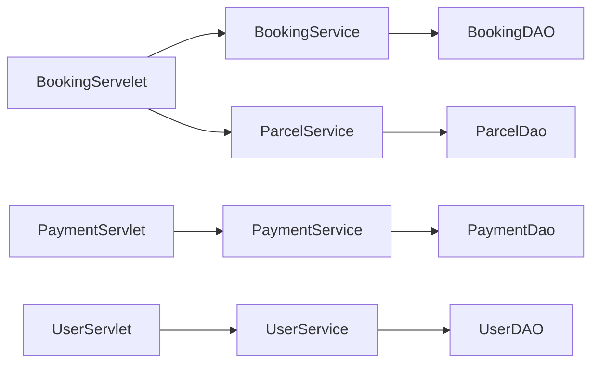

# Classes and Code Structure

## Component Overview
The codebase consists of several packages, including `com.parcelmanagement.bean`, `com.parcelmanagement.dao`, `com.parcelmanagement.service`, `com.parcelmanagement.util`, and `com.parcelmanagement.web`. The main components can be categorized into:

*   **Beans**: These are the data transfer objects (DTOs) that represent the data models used in the application. Examples include `Booking`, `OfficerBooking`, `OfficerTracking`, `Parcel`, `Payment`, `User`, and `UserParcel`.
*   **DAOs (Data Access Objects)**: These classes encapsulate the data access logic and interact with the database. Examples include `BookingDAO`, `ParcelDao`, `PaymentDao`, `UserBookingDAO`, and `UserDAO`.
*   **Services**: These classes provide business logic and encapsulate the core functionality of the application. Examples include `BookingService`, `ParcelService`, `PaymentService`, `UserBookingService`, and `UserService`.
*   **Utilities**: These classes provide utility functions, such as database connections and password hashing. An example is `DBUtil`.
*   **Web Components**: These are the servlet classes that handle HTTP requests and interact with the services and DAOs. Examples include `BookingServelet`, `DeliveryStatusServlet`, `OfficerServlet`, and `UserServlet`.

## Class Hierarchy

```mermaid
classDiagram
    class Booking {
        +getRecName()
        +setRecName()
        +getRecAddress()
        +setRecAddress()
    }
    
    class OfficerBooking {
        +getParcel_Status()
        +setParcel_Status()
        +getPickup_Time()
        +setPickup_Time()
        +getDropoff_Time()
    }
    
    class OfficerTracking {
        +OfficerTracking()
        +getP()
        +setP()
        +getUser_id()
    }
    
    class Parcel {
        +getBookingDate()
        +setBookingDate()
        +getParcelId()
        +setParcelId()
        +getUserId()
    }
    
    class Payment {
        +Payment()
        +getPaymentId()
        +setPaymentId()
        +getParcelId()
    }
    
    class User {
        +getUserId()
        +setUserId()
        +getCustomerName()
        +setCustomerName()
        +getEmail()
    }
    
    class UserParcel {
        +UserParcel()
        +toString()
        +getParcelId()
        +setParcelId()
        +getUserId()
    }
    
    class BookingDAO {
        +insertRecDetails()
        +parcels()
    }
    
    class ParcelDao {
        +Parcel()
        +OfficerTracking()
        +getParcelForOfficerById()
    }
    
    class PaymentDao {
        +insertPayment()
        +getPayment()
        +getParcel()
    }
    
    class UserDAO {
        +registerUser()
        +loginUser()
    }
    
    class BookingService {
        +insertRecDetails()
    }
    
    class ParcelService {
        +getParcelForOfficerById()
        +updateStatus()
    }
    
    class PaymentService {
        +insertPayment()
        +getPayment()
        +getParcel()
    }
    
    class UserService {
        +registerUser()
        +loginUser()
    }
    
    class DBUtil {
        +createConnection()
        +getConnection()
        +closeAllConnection()
    }
```

## Key Components
Some of the key components in the codebase include:

*   **Booking**: Represents a booking with recipient name and address.
*   **Parcel**: Represents a parcel with booking date, parcel ID, and user ID.
*   **Payment**: Represents a payment with payment ID and parcel ID.
*   **User**: Represents a user with user ID, customer name, and email.
*   **BookingService**: Provides business logic for booking-related operations.
*   **ParcelService**: Provides business logic for parcel-related operations.
*   **PaymentService**: Provides business logic for payment-related operations.
*   **UserService**: Provides business logic for user-related operations.

## Inheritance and Composition
The codebase exhibits the following inheritance and composition relationships:

*   **Inheritance**: There is no explicit inheritance relationship between classes. However, some classes have a composition relationship with others (e.g., `BookingService` uses `BookingDAO`).
*   **Composition**: Many classes have a composition relationship with others, such as:
    *   `BookingService` has a `BookingDAO`.
    *   `ParcelService` has a `ParcelDao`.
    *   `PaymentService` has a `PaymentDao`.
    *   `UserService` has a `UserDAO`.

## Interfaces and Contracts
The codebase does not explicitly define interfaces. However, some classes have method signatures that can be considered as contracts:

*   **DAO classes**: These classes have method signatures that define how to interact with the database.
*   **Service classes**: These classes have method signatures that define the business logic operations.

## Design Patterns
The codebase exhibits the following design patterns:

*   **MVC (Model-View-Controller)**: The codebase follows the MVC pattern, with the servlets acting as controllers, the services and DAOs acting as models, and the JSPs acting as views.
*   **Service-Oriented Architecture (SOA)**: The codebase is designed around services that provide business logic operations.
*   **Data Access Object (DAO) pattern**: The codebase uses DAOs to encapsulate data access logic.

## Component Relationships

## Module Dependencies
The codebase has the following module dependencies:

*   **Java classes**: The Java classes depend on the DAO classes and utility classes.
*   **DAO classes**: The DAO classes depend on the database connection utility class (`DBUtil`).
*   **Service classes**: The service classes depend on the DAO classes and other service classes.
*   **Servlet classes**: The servlet classes depend on the service classes and other utility classes.