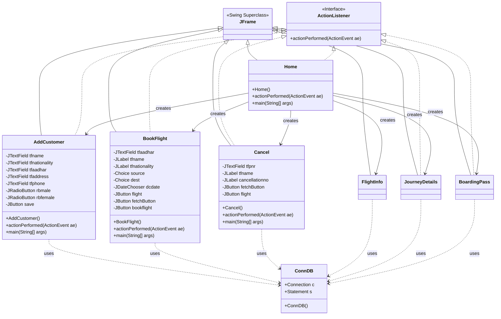
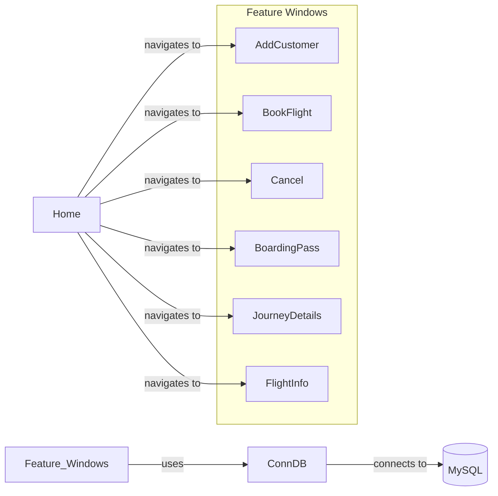

# Classes and Code Structure

## Component Overview
The Airline Management System is a Java Swing-based desktop application. Its structure is centered around a main home screen that provides navigation to various functionalities, each implemented as a separate `JFrame` window. A dedicated database connection class, `ConnDB`, handles all interactions with the MySQL database, centralizing data access logic.

-   **`Home`**: The main application window and central navigation hub. It uses a `JMenuBar` to launch other functional components.
-   **`ConnDB`**: A crucial utility class responsible for establishing and managing the connection to the MySQL database using JDBC. It is instantiated by every component that needs to query or update data.
-   **`AddCustomer`**: A GUI form for registering new customers. It collects personal details and saves them to the `passenger` table in the database.
-   **`BookFlight`**: A comprehensive GUI form for booking flights. It allows fetching customer details via their Aadhar number, selecting a source and destination, viewing available flights, and saving the reservation.
-   **`FlightInfo`**: A simple display window that shows a list of all available flights from the `flight` table in a `JTable`.
-   **`JourneyDetails`**: A component to search for and display the details of a specific flight reservation using the PNR number.
-   **`Cancel`**: A GUI form that allows for the cancellation of a booked ticket. It fetches reservation details by PNR and performs the cancellation by deleting the reservation record and adding a record to the `cancel` table.
-   **`BoardingPass`**: A component to generate and display a boarding pass for a passenger based on their PNR number.

## Class Hierarchy

This diagram illustrates the core structure of the application. All UI classes are specializations of `JFrame`, inheriting windowing capabilities. Most of them also implement the `ActionListener` interface to handle user interactions like button clicks. The `Home` class acts as a factory or launcher for all other UI frames. Critically, all frames that interact with the database create an instance of and use the `ConnDB` class, showing a clear dependency for data persistence.

## Key Components

### `Home` (extends JFrame, implements ActionListener)
The entry point of the user interface after login. It contains no business logic itself but is responsible for creating and displaying the other functional windows.
-   **Methods**:
    -   `Home()`: Constructor that sets up the main window, background image, and the menu bar.
    -   `actionPerformed(ActionEvent ae)`: Handles menu item clicks to instantiate and show other frames like `AddCustomer`, `BookFlight`, etc.

### `ConnDB`
A non-GUI utility class that encapsulates all JDBC logic for connecting to the database.
-   **Properties**:
    -   `Connection c`: The active database connection object.
    -   `Statement s`: The object used for executing static SQL statements.
-   **Methods**:
    -   `ConnDB()`: Constructor that loads the MySQL driver, establishes a connection to the `airlinemanagementsystem` database, and creates a `Statement` object.

### `BookFlight` (extends JFrame, implements ActionListener)
A key component for the core business logic of booking a ticket.
-   **Properties**:
    -   `JTextField tfaadhar`: Input for the customer's Aadhar number.
    -   `JLabel tfname`, `tfnationality`, etc.: Labels to display fetched customer data.
    -   `Choice source`, `dest`: Dropdown menus for flight source and destination.
    -   `JDateChooser dcdate`: A calendar component for selecting the travel date.
    -   `JButton fetchButton`, `flight`, `bookflight`: Buttons to trigger actions.
-   **Methods**:
    -   `BookFlight()`: Constructor to initialize and lay out all the Swing components on the frame.
    -   `actionPerformed(ActionEvent ae)`: A multi-functional handler that checks which button was pressed. It either fetches user data, fetches flight details based on source/destination, or inserts a new record into the `reservation` table to finalize the booking.

## Inheritance and Composition

### Inheritance
-   **Type**: Single Inheritance
-   **Description**: All user interface classes (`Home`, `AddCustomer`, `BookFlight`, etc.) use single inheritance by extending `javax.swing.JFrame`. This is an "is-a" relationship, where each class *is a* specialized type of window. This allows them to inherit all the fundamental behaviors of a graphical window, such as having a title bar, borders, and the ability to be displayed on the screen.

### Composition
-   **Type**: Aggregation/Composition
-   **Description**: The UI classes exhibit a strong "has-a" relationship with various Swing components. For example, the `AddCustomer` class *has a* `JTextField` for the name, a `JRadioButton` for gender, and a `JButton` for saving. These components are integral parts of the `AddCustomer` frame; their lifecycle is managed by and dependent on the frame itself. This is a classic example of building a complex object (the window) by assembling simpler objects (the UI controls).

### Association
-   **Type**: "Uses-a" Relationship (Dependency)
-   **Description**: A clear "uses-a" relationship exists between the UI frames and the `ConnDB` class. Classes like `BookFlight`, `Cancel`, and `AddCustomer` are not composed of a `ConnDB` object, but they depend on it to perform their tasks. They create a temporary instance of `ConnDB` within their methods (`actionPerformed`) to execute SQL queries. The lifecycle of the UI frame is independent of the `ConnDB` instance it creates.

## Interfaces and Contracts

The primary interface used throughout the project is `java.awt.event.ActionListener`.

-   **Interface**: `java.awt.event.ActionListener`
-   **Contract**: Any class that implements this interface must provide a concrete implementation for the following method:
    -   `public void actionPerformed(ActionEvent ae)`
-   **Usage**: This contract is fundamental to the application's event-driven nature. UI classes like `Home`, `AddCustomer`, and `BookFlight` implement this interface. They then register themselves as listeners to components like `JButton` or `JMenuItem` using the `addActionListener(this)` method. When a user clicks a button, the button fires an `ActionEvent`, and the `actionPerformed` method in the listening class is automatically invoked, providing a clear entry point to handle the user's action.

## Design Patterns

### Observer Pattern (Listener)
The most prominent design pattern used is the **Observer Pattern**, implemented through the `ActionListener` interface.
-   **Subject (Observable)**: The Swing components like `JButton` and `JMenuItem`. They maintain a list of listeners and notify them when an event (like a click) occurs.
-   **Observer (Listener)**: The `JFrame` classes (`Home`, `AddCustomer`, etc.) that implement `ActionListener`. They register with the subject to be notified of events.
-   **How it works**: When a user clicks a `JButton` (the Subject), it calls the `actionPerformed` method on all its registered `ActionListener` objects (the Observers). This decouples the button from the code that runs when it's clicked. The button doesn't need to know what action will be performed; it only needs to know who to notify. This makes the code modular and easier to manage.

## Component Relationships

## Module Dependencies
The `airlinemanagementsystem` package is largely self-contained but relies on several external libraries and standard Java APIs to function.

-   **Standard Java Libraries**:
    -   `javax.swing.*`: The core dependency for the entire graphical user interface (GUI), providing components like `JFrame`, `JButton`, `JLabel`, etc.
    -   `java.awt.*` and `java.awt.event.*`: Used for GUI layout management, styling (colors, fonts), and handling user interaction events.
    -   `java.sql.*`: The Java Database Connectivity (JDBC) API, used by `ConnDB` to connect to and interact with the MySQL database.

-   **Third-Party Libraries**:
    -   `com.toedter.calendar.JDateChooser` (from JCalendar library): Used in `BookFlight.java` to provide a user-friendly calendar widget for date selection.
    -   `net.proteanit.sql.DbUtils` (from rs2xml.jar): Used in `FlightInfo.java` and `JourneyDetails.java`. This is a utility library that simplifies the process of populating a `JTable` directly from a JDBC `ResultSet`, significantly reducing boilerplate code.