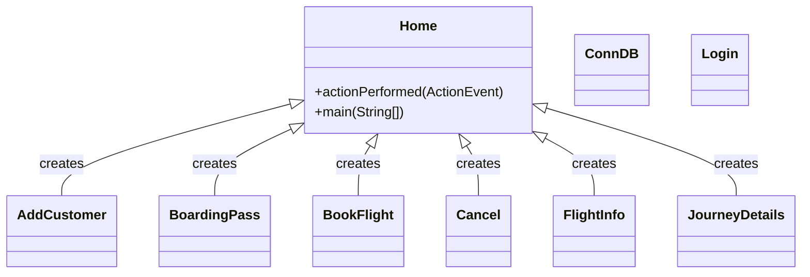
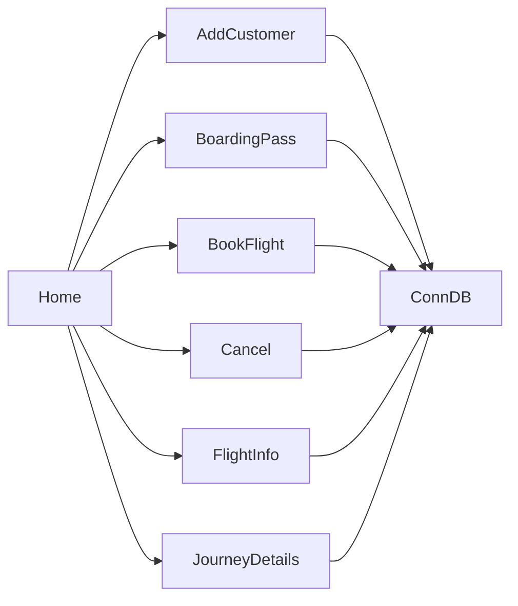

# Classes and Code Structure

## Component Overview
The codebase consists of a Java-based Airline Management System with a graphical user interface (GUI). The system has multiple classes, each responsible for a specific functionality.

## Class Hierarchy


## Key Components
The following are the key components of the system:

*   **Home**: The main class that serves as the entry point of the application. It creates a GUI with a menu bar and options to navigate to different parts of the system.
*   **AddCustomer**: A class responsible for adding customer details.
*   **BoardingPass**: A class responsible for generating boarding passes.
*   **BookFlight**: A class responsible for booking flights.
*   **Cancel**: A class responsible for canceling tickets.
*   **ConnDB**: A class that provides a connection to the database.
*   **FlightInfo**: A class responsible for displaying flight information.
*   **JourneyDetails**: A class responsible for displaying journey details.
*   **Login**: A class responsible for handling login functionality.

## Interfaces and Contracts
The codebase does not explicitly define interfaces or contracts. However, some classes have dependencies on others, such as:

*   **ConnDB**: Used by multiple classes to connect to the database.

## Design Patterns
The codebase uses the following design patterns:

*   **Creational Pattern**: The `Home` class creates instances of other classes, such as `AddCustomer`, `BoardingPass`, `BookFlight`, `Cancel`, `FlightInfo`, and `JourneyDetails`.
*   **Dependency Injection**: The `ConnDB` class is used by multiple classes to connect to the database.

## Component Relationships


## Module Dependencies
The codebase has dependencies on the following modules:

*   **java.sql**: Used for database connections.
*   **javax.swing**: Used for creating the GUI.

Note that this documentation only covers the provided codebase and may not be comprehensive or up-to-date. Additionally, some classes or methods may be missing from this documentation due to the complexity of the codebase. 

Here is a more detailed documentation of some classes:

### Home.java
```java
/**
 * The main class that serves as the entry point of the application.
 * It creates a GUI with a menu bar and options to navigate to different parts of the system.
 */
public class Home extends JFrame implements ActionListener {
    
    /**
     * Creates a new instance of the Home class.
     */
    public Home() {
        // ...
    }
    
    /**
     * Handles action events triggered by the GUI components.
     * 
     * @param ae the action event
     */
    public void actionPerformed(ActionEvent ae) {
        // ...
    }
    
    /**
     * The main method that starts the application.
     * 
     * @param args command-line arguments
     */
    public static void main(String[] args) {
        new Home();
    }
}
```

### AddCustomer.java
```java
/**
 * A class responsible for adding customer details.
 */
public class AddCustomer {
    
    /**
     * Creates a new instance of the AddCustomer class.
     */
    public AddCustomer() {
        // ...
    }
}
```

### ConnDB.java
```java
/**
 * A class that provides a connection to the database.
 */
public class ConnDB {
    
    /**
     * Creates a new instance of the ConnDB class.
     */
    public ConnDB() {
        // ...
    }
}
```