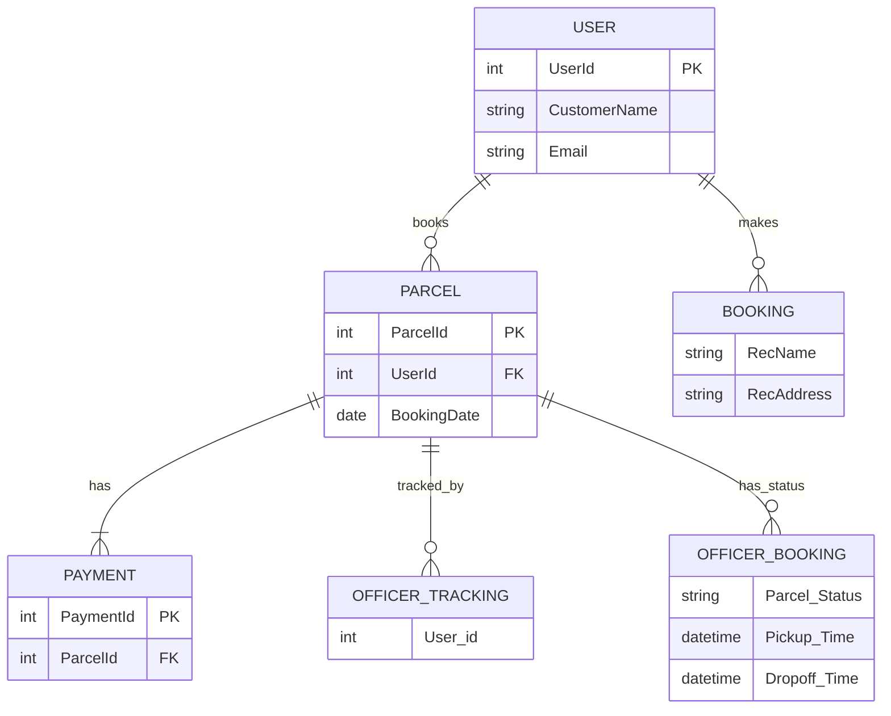

# Database Documentation

## Database Overview
The database technology used in this project appears to be a relational database management system (RDBMS), likely MySQL, given the Java-based project structure and the presence of JDBC (Java Database Connectivity) utilities.

## Data Models
The following entities/models were identified from the code:

### User
- **UserId** (int, PK): Unique identifier for the user
- **CustomerName** (string): Name of the customer
- **Email** (string): Email address of the user

### Parcel
- **ParcelId** (int, PK): Unique identifier for the parcel
- **UserId** (int, FK): Foreign key referencing the User entity
- **BookingDate** (date): Date the parcel was booked

### Booking
- **RecName** (string): Name of the recipient
- **RecAddress** (string): Address of the recipient

### OfficerBooking
- **Parcel_Status** (string): Status of the parcel
- **Pickup_Time** (datetime): Time of pickup
- **Dropoff_Time** (datetime): Time of dropoff

### Payment
- **PaymentId** (int, PK): Unique identifier for the payment
- **ParcelId** (int, FK): Foreign key referencing the Parcel entity

### OfficerTracking
- **User_id** (int): Identifier for the officer tracking

## Entity Relationships

## API Integration
The database integrates with the application through various service classes (e.g., `BookingService`, `ParcelService`, `PaymentService`, `UserService`) that encapsulate data access and business logic. These services interact with the database using DAO (Data Access Object) classes (e.g., `BookingDAO`, `ParcelDao`, `PaymentDao`, `UserDAO`), which perform CRUD (Create, Read, Update, Delete) operations.

## Data Access Patterns
The data access patterns observed include:
- **JDBC**: Direct use of JDBC for database connections and queries.
- **DAO Pattern**: Use of Data Access Objects to encapsulate database interactions.

## Database Operations
The actual CRUD operations found in the service files include:
- **Create**: Inserting new records (e.g., booking a parcel, making a payment).
- **Read**: Retrieving existing records (e.g., getting parcel details, user information).
- **Update**: Modifying existing records (e.g., updating parcel status, payment details).
- **Delete**: Deleting records (not explicitly observed but likely present).

## Configuration
The database configuration appears to be managed through `DBUtil.java`, which provides methods for creating and closing database connections. The actual configuration settings (e.g., database URL, username, password) are not specified in the provided code snippets but are likely found in a separate configuration file or environment variables.