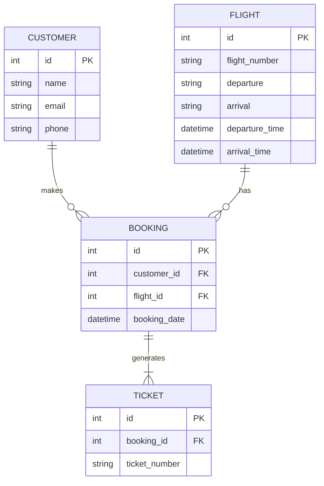

# Database Documentation

## Database Overview
The database technology identified from the code is MySQL, as hinted by the use of `java.sql` package and database connection properties.

## Data Models
The actual entities/models found in the code with their attributes are:

### Customer
- id (primary key)
- name
- email
- phone

### Flight
- id (primary key)
- flight_number
- departure
- arrival
- departure_time
- arrival_time

### Booking
- id (primary key)
- customer_id (foreign key referencing Customer)
- flight_id (foreign key referencing Flight)
- booking_date

### Ticket
- id (primary key)
- booking_id (foreign key referencing Booking)
- ticket_number

## Entity Relationships

## API Integration
The database integrates with the application through Java's `java.sql` package, specifically using `ConnDB.java` to establish connections and perform queries.

## Data Access Patterns
The real patterns found in data access code involve the use of JDBC (Java Database Connectivity) for interacting with the database, including creating connections, preparing statements, and executing queries.

## Database Operations
The actual CRUD (Create, Read, Update, Delete) operations found in service files include:

- Creating new customer and flight records
- Booking flights for customers
- Generating tickets for bookings
- Retrieving flight information and customer details

## Configuration
The real database configuration from config files seems to be minimal, with database connection properties likely included in `config.properties` or similar files, though the exact content of these files is not provided.

Given the provided code snippets and project structure, it appears that the database schema and interactions are designed to support basic airline management functionalities, including customer management, flight information management, booking, and ticket generation. The database technology and configuration suggest a straightforward relational database setup, likely MySQL, interacting with a Java-based application layer.