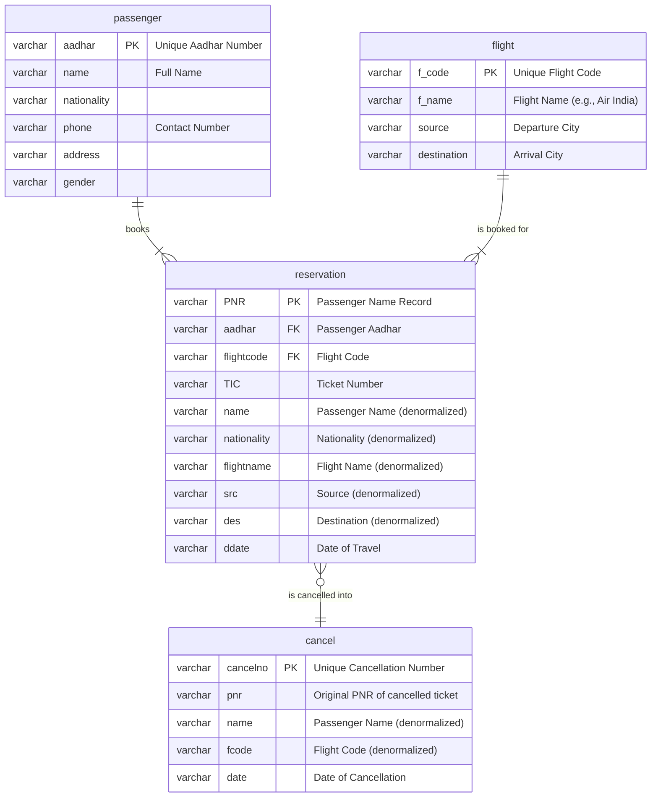

# Database Documentation

## Database Overview
The application utilizes a **MySQL** relational database. The connection is established using the `com.mysql.cj.jdbc.Driver`, as specified in the `ConnDB.java` file. The database is named `airlinemanagementsystem`, and all data related to passengers, flights, and reservations is stored within it.

## Data Models
The data models are inferred from the raw SQL queries embedded within the application's Java Swing components. The application interacts with four primary tables: `passenger`, `flight`, `reservation`, and `cancel`.

*   **passenger**: Stores personal information about customers. The `aadhar` number is used as the unique identifier to fetch passenger details when booking a flight.
*   **flight**: Contains details about available flights, including their code, name, source, and destination.
*   **reservation**: Acts as a transactional table linking passengers to specific flights they have booked. It stores a snapshot of passenger and flight details at the time of booking.
*   **cancel**: Serves as a log for all cancelled tickets. When a reservation is cancelled, its record is deleted from the `reservation` table and a new entry is created here.

## Entity Relationships
The relationships are derived from how data is linked across different operations, such as fetching a passenger to create a reservation. A passenger can have multiple reservations, and a flight can be booked in many reservations. A reservation, if cancelled, results in a single cancellation record.

## API Integration
The application is a Java Swing desktop GUI, not a web service with APIs. The database is tightly coupled with the user interface components. Database operations are triggered directly by user actions (e.g., button clicks) within the `actionPerformed` methods of each Swing frame (`JFrame`).

*   **`AddCustomer.java`**: Interacts with the `passenger` table to create new customer records.
*   **`BookFlight.java`**: Fetches data from `passenger` and `flight`, then inserts a new record into the `reservation` table.
*   **`Cancel.java`**: Reads from the `reservation` table, inserts a record into the `cancel` table, and finally deletes the original record from `reservation`.
*   **`BoardingPass.java` & `JourneyDetails.java`**: Perform read operations on the `reservation` table to display booking information to the user.
*   **`FlightInfo.java`**: Reads and displays all records from the `flight` table.

## Data Access Patterns
The application employs a direct, low-level data access strategy using standard Java Database Connectivity (JDBC).

*   **Connection Management**: A new database connection is established via the `ConnDB` class for nearly every database operation. This is inefficient for high-load systems but simple for this application's scope.
*   **Query Method**: Raw SQL queries are used exclusively. There is no Object-Relational Mapping (ORM) framework like Hibernate or JPA, nor a query builder library.
*   **Query Construction**: SQL queries are built by concatenating strings with user input (e.g., `"... where PNR = '"+pnr+"'"`). This pattern is highly susceptible to SQL Injection vulnerabilities and is not recommended for production applications.
*   **Result Set Processing**: Data is read from `java.sql.ResultSet` objects. In some UI components (`FlightInfo`, `JourneyDetails`), the `net.proteanit.sql.DbUtils` library is used to simplify the process of populating a `JTable` directly from a `ResultSet`.

## Database Operations
The application performs a range of Create, Read, and Delete operations. No Update operations were observed in the codebase.

*   **CREATE**:
    *   `INSERT into passenger ...`: A new passenger is added (`AddCustomer.java`).
    *   `INSERT into reservation ...`: A new flight booking is created (`BookFlight.java`).
    *   `INSERT into cancel ...`: A cancellation record is logged (`Cancel.java`).

*   **READ**:
    *   `SELECT * from passenger where aadhar = ...`: To fetch user details for a new booking (`BookFlight.java`).
    *   `SELECT * from flight`: To display all available flights (`FlightInfo.java`) and populate dropdowns (`BookFlight.java`).
    *   `SELECT * from reservation where PNR = ...`: To show journey details or generate a boarding pass (`JourneyDetails.java`, `BoardingPass.java`, `Cancel.java`).

*   **DELETE**:
    *   `DELETE from reservation where PNR = ...`: A reservation is removed from the active bookings table upon successful cancellation (`Cancel.java`).

## Configuration
All database configuration details are hardcoded within the constructor of the `ConnDB.java` class. The configuration is not stored in an external properties file.

*   **JDBC Driver**: `com.mysql.cj.jdbc.Driver`
*   **JDBC URL**: `jdbc:mysql:///airlinemanagementsystem`
*   **Username**: `root`
*   **Password**: `root`