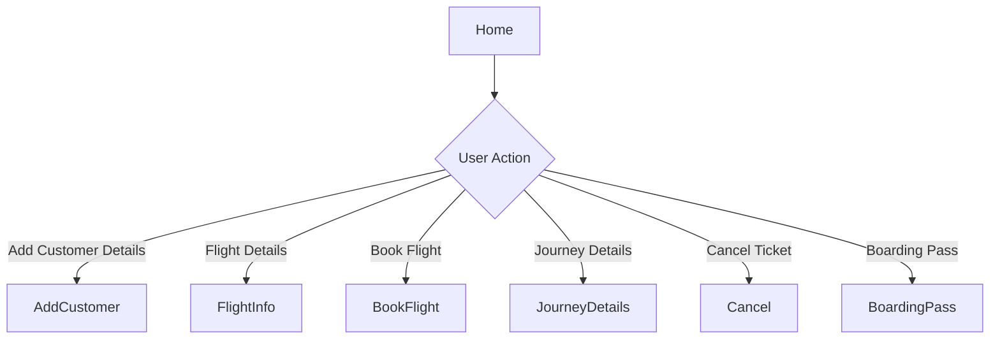
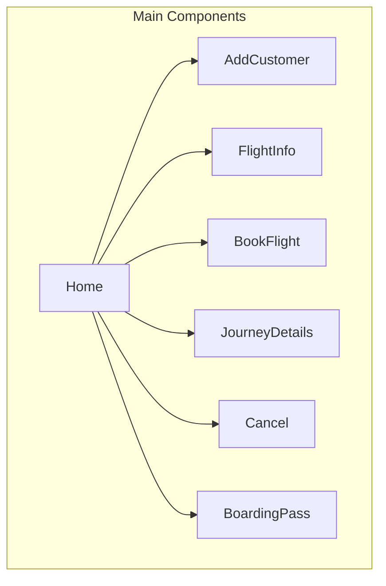

# Web Components and APIs

## API Endpoints
No API endpoints were found in the provided codebase as it appears to be a Java Swing desktop application.

### Authentication
The authentication functionality seems to be handled within the application itself. 
- No specific API endpoints for authentication were found.

### Core Resources
No API endpoints for core resources were found.

## Web Pages and Routes
The application has the following main pages:
- Home
- Add Customer Details
- Flight Details
- Book Flight
- Journey Details
- Cancel Ticket
- Boarding Pass

## User Interface Flow

## Component Architecture

## Authentication Flow
The authentication flow seems to be handled within the `Login.java` file.

## API Integration
No API integration was found in the provided codebase.

## State Management
The state management seems to be handled within individual components.

## User Experience Flow
The user experience flow can be described as follows:
- The user starts at the `Home` page.
- The user can navigate to various pages such as `AddCustomer`, `FlightInfo`, `BookFlight`, `JourneyDetails`, `Cancel`, and `BoardingPass`.
- Each page seems to have its own functionality.

Note that this analysis is based on the provided codebase, which appears to be a Java Swing desktop application. Therefore, there are no web-specific API endpoints or web pages. The application seems to be a standalone desktop application with a graphical user interface. 

Here is a more detailed explanation of each file:

- `Home.java`: This file contains the main application window with a menu bar and various menu items.
- `AddCustomer.java`, `BoardingPass.java`, `BookFlight.java`, `Cancel.java`, `FlightInfo.java`, `JourneyDetails.java`, `Login.java`: These files contain the respective pages or windows with their own functionality.

The application seems to use a database connection class `ConnDB.java` to interact with a database. However, the database schema or API endpoints are not provided in the codebase. 

In conclusion, this application is a desktop application with a graphical user interface, and it does not have web-specific API endpoints or web pages. 

Here is a list of classes and their descriptions:

*   `Home`: The main application window.
*   `AddCustomer`: A page for adding customer details.
*   `BoardingPass`: A page for generating boarding passes.
*   `BookFlight`: A page for booking flights.
*   `Cancel`: A page for canceling tickets.
*   `ConnDB`: A class for connecting to the database.
*   `FlightInfo`: A page for displaying flight information.
*   `JourneyDetails`: A page for displaying journey details.
*   `Login`: A page for logging in to the application.