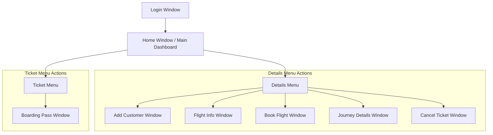
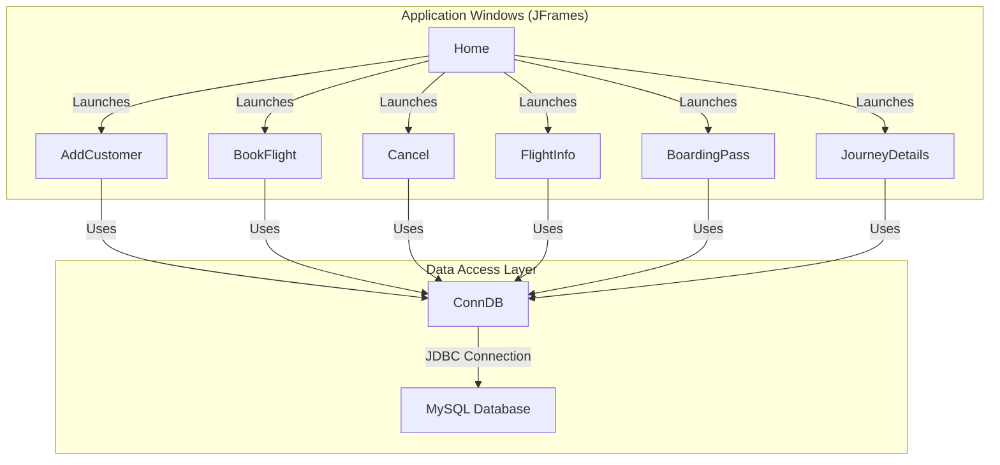
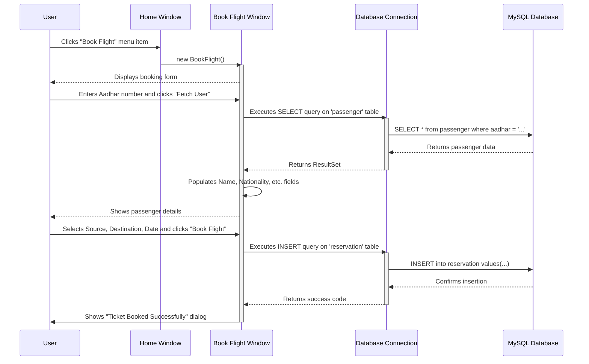

# Web Components and APIs

**Analyst's Note:** The provided codebase is a Java Swing desktop application, not a web application. It does not contain web components, HTTP routes, or REST API endpoints. The following documentation adapts the requested web-centric format to describe the application's desktop UI, data access patterns, and user flow based on the actual Java and SQL code. The term "API" in this context refers to the application's direct interaction with its MySQL database via JDBC.

## API Endpoints (Database Interaction Layer)

The application communicates directly with a MySQL database named `airlinemanagementsystem` using a custom `ConnDB` class. There are no RESTful API endpoints. Instead, data operations are performed by executing raw SQL queries from the application's UI classes.

### Authentication

The project files reference a `Login.java` class, which was excluded from the analysis content. It is inferred that this class handles user authentication by querying the database. The specific table and query are unknown as the code is not available.

### Core Resources (Database Tables & Queries)

The application interacts with several database tables to manage its core resources. The primary data operations are listed below.

*   **Passenger Management**
    *   **Action:** Add a new customer.
    *   **Trigger:** Clicking "SAVE" in the `AddCustomer` window.
    *   **SQL Query:** `INSERT into passenger values('{name}','{nationality}','{phone}','{aadhar}','{address}','{gender}')`
    *   **Action:** Fetch an existing customer's details.
    *   **Trigger:** Clicking "Fetch User" in the `BookFlight` window.
    *   **SQL Query:** `SELECT * from passenger where aadhar = '{aadhar_number}'`

*   **Flight Management**
    *   **Action:** Fetch all available flights.
    *   **Trigger:** Opening the `FlightInfo` window.
    *   **SQL Query:** `SELECT * from flight`
    *   **Action:** Fetch flights for a specific route.
    *   **Trigger:** Clicking "Fetch" in the `BookFlight` window after selecting a source and destination.
    *   **SQL Query:** `SELECT * from flight where source = '{source_location}' and destination = '{destination_location}'`

*   **Reservation Management**
    *   **Action:** Create a new flight booking.
    *   **Trigger:** Clicking "Book Flight" in the `BookFlight` window.
    *   **SQL Query:** `INSERT into reservation values('PNR-{random_id}', 'TIC-{random_id}', '{aadhar}', '{name}', '{nationality}', '{flightname}', '{flightcode}', '{source}', '{destination}', '{date}')`
    *   **Action:** Fetch reservation details by PNR.
    *   **Trigger:** Clicking "Show Details" in `JourneyDetails` or "Enter" in `BoardingPass`.
    *   **SQL Query:** `SELECT * from reservation where PNR = '{pnr_number}'`

*   **Cancellation Management**
    *   **Action:** Cancel a ticket.
    *   **Trigger:** Clicking "Cancel" in the `Cancel` window.
    *   **SQL Queries:**
        1.  `INSERT into cancel values('{pnr}', '{name}', '{cancel_no}', '{flight_code}', '{date}')`
        2.  `DELETE from reservation where PNR = '{pnr_number}'`

## Web Pages and Routes (Application Windows & Navigation)

The application's "pages" are Java Swing `JFrame` windows. Navigation is handled by instantiating and displaying these frame classes in response to user actions (e.g., menu item clicks).

*   **`Login.java`**: The application's entry point for user authentication (inferred).
*   **`Home.java`**: The main dashboard window that appears after a successful login. It contains a `JMenuBar` for navigating to all other features.
*   **`AddCustomer.java`**: A form to add new passenger details to the database.
*   **`FlightInfo.java`**: A window that displays all available flights in a `JTable`.
*   **`BookFlight.java`**: A form to book a flight for a passenger. It fetches passenger and flight data to create a reservation.
*   **`JourneyDetails.java`**: A window to view the details of a specific reservation by entering a PNR number.
*   **`Cancel.java`**: A form to cancel an existing ticket using a PNR number.
*   **`BoardingPass.java`**: A window to generate and display a boarding pass for a given PNR.

## User Interface Flow

The following diagram illustrates the primary navigation flow between the application's windows. The user starts at the (inferred) Login screen and, upon success, navigates the application's features via the Home screen's menu bar.

## Component Architecture

The application follows a monolithic desktop architecture. The `Home.java` class acts as the central hub, launching other feature-specific `JFrame` windows. The `ConnDB.java` class is a critical shared component used by almost all other windows to perform database operations.

## Authentication Flow

While the `Login.java` file is not present for analysis, the application structure implies a straightforward sessionless authentication model.

1.  The user launches the application, and the `Login` window is displayed.
2.  The user enters credentials (e.g., username and password).
3.  Upon submission, the application likely executes a `SELECT` query against a user/admin table in the database to validate the credentials.
4.  If the credentials are valid, the `Login` window is closed, and the `Home` window is instantiated and displayed.
5.  If the credentials are invalid, an error message is shown.
Authentication is only performed once at the start of the application session. There is no concept of tokens or session management beyond the application's runtime.

## API Integration (Database Integration)

The frontend (Java Swing UI) is tightly coupled with the backend (MySQL database).

1.  **Connection Utility**: A central `ConnDB.java` class manages the JDBC connection. It uses the `com.mysql.cj.jdbc.Driver` to connect to a local MySQL database instance.
2.  **Direct Instantiation**: Each `JFrame` class that requires database access (e.g., `BookFlight`, `Cancel`) creates its own instance of `ConnDB` within its constructor or action handler methods.
3.  **Raw SQL Execution**: The UI classes build raw SQL query strings by concatenating string literals with data retrieved from UI components like `JTextField.getText()`.
4.  **Statement Execution**: Queries are executed using the `java.sql.Statement` object provided by the `ConnDB` instance (e.g., `conn.s.executeUpdate(query)` or `conn.s.executeQuery(query)`).
5.  **Data Handling**: The results from `SELECT` queries are returned as a `java.sql.ResultSet`. The application code iterates through this `ResultSet` to extract data and update UI components (e.g., `tfname.setText(rs.getString("name"))`). For displaying tables, the `net.proteanit.sql.DbUtils` library is used to convert a `ResultSet` directly into a `TableModel`.

## State Management

State management is simple and localized.

*   **Component-Level State**: The state of the user's current task is held within the UI components of the active `JFrame` (e.g., the text inside `JTextFields`, the selection in a `Choice` dropdown).
*   **Single Source of Truth**: The MySQL database acts as the application's global state and single source of truth. Data is fetched from the database on-demand when a user requests it (e.g., fetching passenger details by Aadhar) and is persisted back to the database when a user completes an action (e.g., booking a ticket).
*   **No Centralized Store**: There is no centralized in-memory state management store like Redux or a Context API. Each window is responsible for managing its own state and data fetching/persistence logic.

## User Experience Flow

This section details a common user journey: booking a flight for an existing customer.

