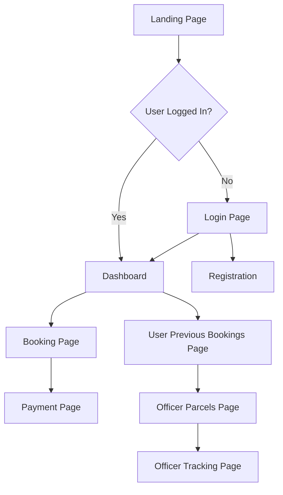
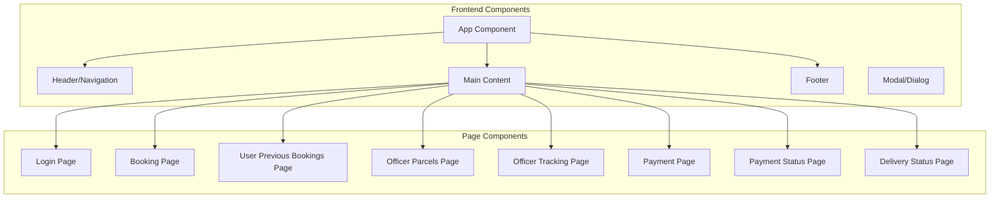

# Web Components and APIs

## API Endpoints

### Authentication
- POST `/UserServlet` - User registration and login
- GET `/LogoutServlet` - User logout

### Core Resources
- **Booking Endpoints**
  - POST `/BookingServelet` - Create a new booking
  - GET `/UserPerviousBookingServlet` - Get user's previous bookings
- **Parcel Endpoints**
  - GET `/OfficerServlet` - Get parcels for officer
  - GET `/OfficerTrackingServlet` - Get parcel tracking information
  - POST `/OfficerTrackingServlet` - Update parcel tracking information
- **Payment Endpoints**
  - POST `/PaymentServlet` - Create a new payment
  - GET `/PaymentStatusServlet` - Get payment status
- **Delivery Endpoints**
  - GET `/DeliveryStatusServlet` - Get delivery status
  - POST `/DeliveryStatusServlet` - Update delivery status

## Web Pages and Routes
- **Login Page**: `/UserServlet` ( handles both login and registration )
- **Logout Page**: `/LogoutServlet`
- **Booking Page**: `/BookingServelet`
- **User Previous Bookings Page**: `/UserPerviousBookingServlet`
- **Officer Parcels Page**: `/OfficerServlet`
- **Officer Tracking Page**: `/OfficerTrackingServlet`
- **Payment Page**: `/PaymentServlet`
- **Payment Status Page**: `/PaymentStatusServlet`
- **Delivery Status Page**: `/DeliveryStatusServlet`

## User Interface Flow

## Component Architecture

## Authentication Flow
The authentication flow is handled by the `UserServlet` which accepts both GET and POST requests. 
- **Login**: The user submits a login request with their credentials. The `UserServlet` verifies the credentials with the `UserDAO` and logs the user in if the credentials are correct.
- **Registration**: The user submits a registration request with their details. The `UserServlet` creates a new user with the `UserDAO` and logs the user in.

## API Integration
The frontend integrates with the backend/APIs using the following patterns:
- **Ajax Requests**: The frontend sends Ajax requests to the backend to fetch data or perform actions.
- **Servlet Requests**: The frontend sends requests to the backend servlets to perform actions or fetch data.

## State Management
The state management pattern used is **Session-based**. The user's session is managed by the backend and the frontend uses the session ID to authenticate requests.

## User Experience Flow
The user experience flow is as follows:
- The user lands on the landing page and is prompted to login or register.
- After logging in, the user is taken to the dashboard where they can perform actions such as booking a parcel, viewing previous bookings, etc.
- The user can also view their previous bookings, officer parcels, and tracking information.
- The user can perform payments and view payment status.
- The user can also view delivery status.